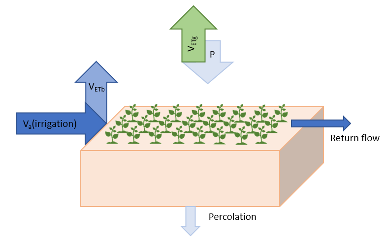
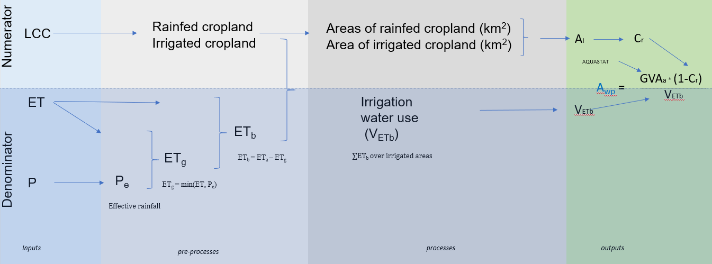

# WaPOR4Awp
Scripts for estimating agricultural water productivity (Awp) to support monitoring SDG indicator 6.4.1 using WaPOR data. The scripts consist of a Colab version [more details]https://github.com/wateraccounting/wapor4awp/blob/main/README.md#google-colab-notebooks) for calculating Awp at country level and scripts to estimate Awp globally (current WaPOR version 2 is for Africa and MENA region). 

 

**Authors:** 
* Seleshi Yalew,
* Suzan Dehati, 
* Marloes Mul

**Cite as:** 
 Yalew, S., Dehati, S., Mul, M., 2023 Scripts for calculating agricultural water productivity using WaPOR and Aquastat data. Standardized protocol for land and water productivity analyses using WaPOR (v1.0).
 If you encounter problems, do let us know @wateraccounting_project@un-ihe.org

## Objective
To develop an interactive dashboard to support monitoring Sustainable Development Goal (SDG) indicator 6.4.1 - Change in Water Use Efficiency (CWUE) using remote sensing data (RS). The focus will be on an alternative approach to estimate agricultural water use efficiency (water productivity) using the FAO WaPOR database (Safi, 2022; Gillet and Biancalani, 2022).

## SDG indicator 6.4.1 – Change in Water Use Efficiency
SDG indicator 6.4.1 tracks the value added in US dollars per volume of water withdrawn. It considers water use by all economic activities aggregated into the three major sectors of agriculture, industry and the service sector. The indicator allows countries to assess to what extent their economic growth depends on the use of their water resources. SDG indicator 6.4.1 is calculated using the following equation (FAO, 2017).

             (1)

Where:

Awe, Mwe, Swe = water use efficiency of agriculture, industry, and services sector [USD/m3]

PA, Pm, Ps = proportion of total water withdrawn per sector [%]

The data for computing this indicator is usually compiled by National Statistical Offices (NSO) of countries. To obtain a comprehensive data set annually requires a lot of human and financial resources, the data is therefore often incomplete and is filled through interpolation or using estimations. The data is reported at a national level, although regional differences in climate and water availability within countries can affect the interpretation of this indicator, in particular for agriculture. RS offers spatially disaggregated data which creates the opportunity to monitor land and water use at various scales, which can assist in monitoring the agricultural component of SDG 6.4.1.

## Agricultural water use efficiency
The equation to calculate water use efficiency in irrigated agriculture (Awe) is as follows (FAO, 2017):

   					        (2)

With:

GVAa = Gross Value Added by agriculture (river and marine fisheries and forestry excluded) (USD)

Va = Volume of water used by the agricultural sector (including irrigation, livestock, and aquaculture) (m3)

1-Cr  = Proportion of agricultural GVA produced by irrigated agriculture obtained from AQUASTAT

## FAO’s WaPOR database
RS data for hydrological and agricultural applications has improved significantly over the past decade. More and more products are also available for open access. One such comprehensive database is WaPOR (FAO’s data portal to monitor Water Productivity through Open access of Remotely sensed derived data) which provides information on biomass production and evapotranspiration for Africa and the Near East in near real-time, covering the period 1 January 2009 to date. In addition to that, it provides annual Land Cover Classification (LCC) maps, based on Copernicus land use data from 2015 with an additional annually varying split of the croplands into irrigated and rainfed agriculture. Table 1 shows the WaPOR data used for the analyses. As the tool will support the annual reporting of the SDG at the country level, we will use WaPOR Level 1 – 250m resolution which covers the entire continent of Africa and parts of the Middle East.  

Table 1. WaPOR data used for computing Awe
Data	WaPOR level	Spatial resolution	Temporal resolution
Actual evapotranspiration & interception (ET)	Level 1	250m	Monthly
Precipitation (P)	Level 1	5km	Monthly
Land cover classification (LCC)	Level 1	250m	Annual

## An alternative approach for estimating Awe using remote sensing
Whereas RS provides a lot of opportunities, it is not able to monitor the denominator of the Awe (equation 2) on agricultural water withdrawals (Va). However, RS can monitor the water consumption in irrigated agriculture (VETb) by monitoring the actual evapotranspiration. While the two are not the same, they are connected as can be seen in Figure 1. Actual evapotranspiration (ET) can come from two sources, rainfall and water withdrawal for irrigation, also called green and blue ET respectively (ETg and ETb) (Chukalla et al., 2015). Especially in large irrigation systems where irrigation water is reused many times, ETb and water withdrawals can approximate each other (Hellegers and van Halsema, 2020), in other cases the difference can be approximated using an irrigation efficiency coefficient. Using VETb, instead of Va, we decided to rename the indicator agricultural water productivity (Awp in USD/m3) to clearly distinguish between the two.

 
 
Figure 1 Differences between irrigation withdrawals in relation to ETb (after Karimi et al., 2013)

There is another major distinction between Awe and Awp, whereby the analyses of Awp focus on irrigated agriculture, even though the definition of Awe includes livestock and aquaculture.

## Methodology for estimating Awp
An overview of the proposed workflow is presented in Figure 2. The numerator of equation 2 depicts the value derived from the water use (GVAa * (1-Cr)), the information to calculate this is derived from global databases such as AQUASTAT and the World Bank. The denominator, depicting the water use by agriculture (VETb) is estimated using the FAO WaPOR database and described in the following section.   

  
 
Figure 2. Computation workflow; further described in the following sections, based on Safi, 2022

### Denominator of Awp (VETb)

While there are various ways to split ETg and ETb, the different approaches are not easy to validate as there are no direct measurements of ETg and ETb (Msigwa et al., 2021). We decided to use a simplified approach, approximating effective rainfall (Pe) to be ETg. The effective monthly rainfall was calculated using Brouwer and Heibloem (1986)’s equations:

Pe = 0.8 * P – 25, if P > 75 mm/month				(3)

Pe = max (0.6 * P – 10, 0), if P < 75 mm/month					 

ETb or blue water use per annum (in mm/year) is then calculated at monthly timesteps and aggregated to annual values using the following formula:

   		     		(4)

With ET being the actual evapotranspiration and interception from WaPOR. The final step is to aggregate ETb,y for the irrigated areas to compute the total water consumed (VETb) by irrigated agriculture:

     			  	(5)

Awp can then be calculated by adapting equation 2 (by replacing Va with VETb):

  				      	(6)

## Change and trend in Awp
The final step is to calculate the change (c) and trend (t) in Awp using the following formulas, based on FAO (2017):

                  #year to year			(7)

                   #start to base year (2015)				(8)

## Google Colab Notebooks
To determine a country's Awp, three modules was developed through Colab notebook containing specific scripts.

Module_0 focuses on downloading WaPOR data on actual evapotranspiration (AETI), precipitation (PCP), land cover map (LCC), and gross biomass water productivity (GBWP). This data serves as the foundational information for subsequent calculations.

Module_1 handles the pre-processing of the acquired data to ensure uniform spatial resolution. Additionally, this module involves the computation of PE and ET blue.

Finally, Module_2, involves calculating the volume of ET blue and Awp for multiple years. This final computation allows us to determine the country's Awp over the specified time frame.

A README file is included in the "Country_based_Colab_WaPOR4Awp" folder to provide instructions on using the Google Colab notebooks.

## Acknowledgements
This dashboard was developed in the context of the “Monitoring land and water productivity by Remote Sensing (WaPOR phase 2) project” funded by the Ministry of Foreign Affairs of the Netherlands.

## References
Brouwer, C. and Heibloem, M., 1986. Irrigation water management: irrigation water needs. FAO Training manual, 3. https://www.fao.org/3/s2022e/s2022e00.htm#Contents 

Chukalla, A.D., Krol, M.S. and Hoekstra, A.Y., 2015. Green and blue water footprint reduction in irrigated agriculture: effect of irrigation techniques, irrigation strategies and mulching. Hydrology and earth system sciences, 19(12), pp.4877-4891.

FAO, 2017. Integrated Monitoring Guide for SDG 6 Step-by-step monitoring methodology for indicator 6.4.1 on water-use efficiency Version 2017-03-10

Gillet, V. and Biancalani, R. 2022. Guidelines for calculation of the agriculture water use efficiency for global reporting – The agronomic parameters in the SDG indicator 6.4.1: yield ratio and proportion of rainfed production. Rome, FAO

Hellegers P, van Halsema G (2021) SDG indicator 6.4.1 “change in water use efficiency over time”: Methodological flaws and suggestions for improvement. Science of The Total Environment 801: 149431

Safi, C., Pareeth, S., Yalew, S., van der Zaag, P. and Mul, M., 2023. Estimating agricultural water productivity using remote sensing derived data. Modeling Earth Systems and Environment, pp.1-11.

Safi, C., 2022. Monitoring SDG 6.4.1 indicator at national and sub-national scale using open access remote sensing-derived data – case study of Lebanon. MSc thesis IHE Delft institute for water education, Delft, the Netherlands. 

Msigwa, A., Komakech, H. C., Salvadore, E., Seyoum, S., Mul, M. L., & van Griensven, A. (2021). Comparison of blue and green water fluxes for different land use classes in a semi-arid cultivated catchment using remote sensing. Journal of Hydrology: Regional Studies, 36, 100860.

